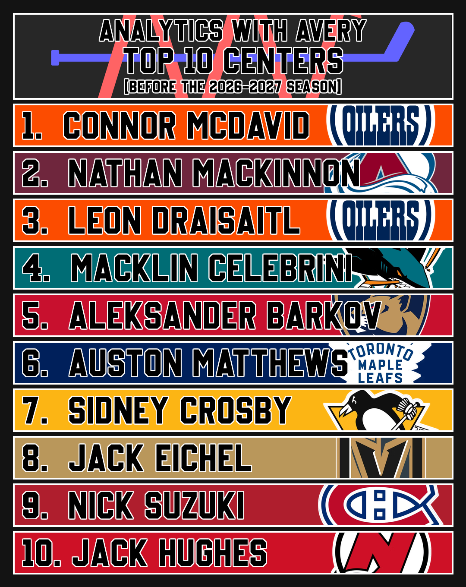

# NHL Social Ranking Graphics

## Description
A generator for the shareable NHL graphics I post to my Analytics With Avery's socials. Current graphics include top ten lists, division standings lists, and trophy/podium lists.

### Features
* **Top Ten Graphics:** Generates a graphic per category (Centers, Goalies, Playmakers, etc.) showing a top ten ranking.
* **Standings Graphics:** Generates a graphic per division showing a one to eight standings order, with each row's border colour showcasing projected playoff status.
* **Trophy Graphics:** Generates a graphic per trophy (Hart, Norris, Calder, etc.) showing the top 5 candidates, with each row's border colour signalling rank (gold, silver, bronze, then dark grey).

<p align="center">
  
  <br />
  <em>Example top ten graphic.</em>
</p>


## Installation
### Prerequisites
* **Python 3.9+**

### Setup
1. **Clone the repository:**

```bash
git clone https://github.com/AveryJD/social-ranking-graphic.git
cd social-ranking-graphic
```

2. **Create a virtual environment:**

```bash
python -m venv venv
source venv/bin/activate  # On Windows: venv\\Scripts\\activate
```

3. **Install dependencies:**

```bash
pip install -r requirements.txt
```


## Usage
The typical workflow is:
1. Set the season's predictions
2. Generate the desired graphics


### Step 1: Set Predictions
Open src/lists.py and set the season, along with changing any names/positions of the top tens, standings, and trophies to generate graphics for:
```python
SEASON = '2026-2027'

TOP_TENS = {
    'Centers': {
        'Connor McDavid': 'EDM',
        # ...ordered from 1st to 10th
    },
    # ...one entry per category
}

STANDINGS = {
    'Pacific': {
        'Edmonton Oilers': 'EDM',
        # ...ordered from 1st to 8th
    },
    # ...one entry per division
}

TROPHY_CANDIDATES = {
    'Hart': {
        'Connor McDavid': 'EDM',
        # ...ordered from 1st to 5th
    },
    # ...one entry per trophy
}
```

Team colours and per-team logo crop offsets are set separately in src/constants.py, and only need to be revisited if a team rebrands or a logo crop looks off.


### Step 2: Generate Standings Graphics
Execute the following script from the project root:
```bash
python src/standings.py
```

This script will generate a graphic for every division in STANDINGS.

Generated graphics will be saved to the graphics/{SEASON}/standings folder.


### Step 3: Generate Top Ten Graphics
Execute the following script from the project root:
```bash
python src/top_ten.py
```

This script will generate a graphic for every category in TOP_TENS.

Generated graphics will be saved to the graphics/{SEASON}/top_ten folder.


### Step 4: Generate Trophy Graphics
Execute the following script from the project root:
```bash
python src/trophies.py
```

This script will generate a graphic for every award in TROPHY_CANDIDATES.

Generated graphics will be saved to the graphics/{SEASON}/trophies folder.


## License
This project is licensed under the GNU General Public License v3.0. See the LICENSE file for details.


## Disclaimer
This project is for educational purposes and is not affiliated with the NHL. NHL team logos and colours are used for identification purposes only.
